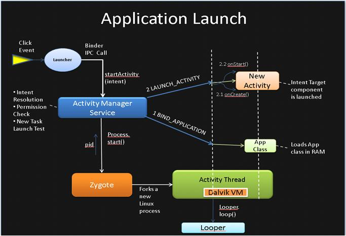
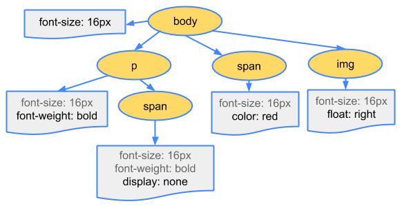
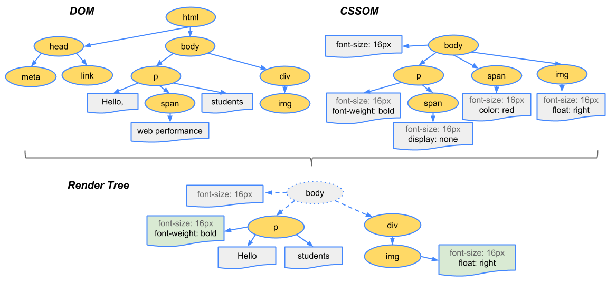

# 网站优化

## 目的
让网站能够快速呈现给用户，我需先了解浏览器是如何通过网址把网站呈现出来

## 网址变成网站的过程

1. 网络请求，请求 HTML ，CSS，JavaScript
2. 将代码变成网页，通过关键 **呈现路径**

我们将会对上面的两个方面进行优化

## 什么是关键呈现路径
浏览器将 HTML CSS 和 JavaScript 代码转化为网页所经历的 **过程步骤**

也就是代码变成网页的 ** 过程步骤**

### 文档对象模型 (DOM)

	<html>
	  <head>
	    <meta name="viewport" content="width=device-width,initial-scale=1">
	    <link href="style.css" rel="stylesheet">
	    <title>Critical Path</title>
	  </head>
	  <body>
	    
Hello web performance students!

	    

	  </body>
	</html>

存储在树状的数据结构上面，如下：



### CSS 对象模型 (CSSOM)

	<link href="style.css" rel="stylesheet">

在浏览器构建我们这个简单页面的 DOM 时，在文档的 head 部分遇到了一个 link 标记，引用一个外部 CSS 样式表：`style.css` , 立即发出请求获取文件

CSS 代码
	body { font-size: 16px }
	p { font-weight: bold }
	span { color: red }
	p span { display: none }
	img { float: right }

###  渲染树构建

DOM 树与 CSSOM 树合并后形成渲染树

完成渲染树，便开始进行布局

### 布局
从渲染树的根节点开始进行遍历，弄清每个对象在网页上的确切大小和位置

输出的是一个“盒模型”  

	<html>
	  <head>
	    <meta name="viewport" content="width=device-width,initial-scale=1">
	    <title>Critial Path: Hello world!</title>
	  </head>
	  <body>
	    

	      
Hello world!

	    

	  </body>
	</html>

### 绘制
CSS 越复杂，绘制需要的时间就越长（例如，单色的绘制开销“较小”，而阴影的计算和渲染开销则要“大得多”）。

### 总的过程

# 优化
## 请求方面
### 1. 减少文件大小
将所有的文件都进行压缩处理，没用的空格跟注释都得删除掉

### 2. 内联文件
把 css ，js，都直接写在 HTML 里面

##   关键呈现路径
### 减少阻止呈现的资源
#### CSS 
根据情况用 Media 读取相应的 CSS 代码

#### JS
为 script 添加 `async`
	
